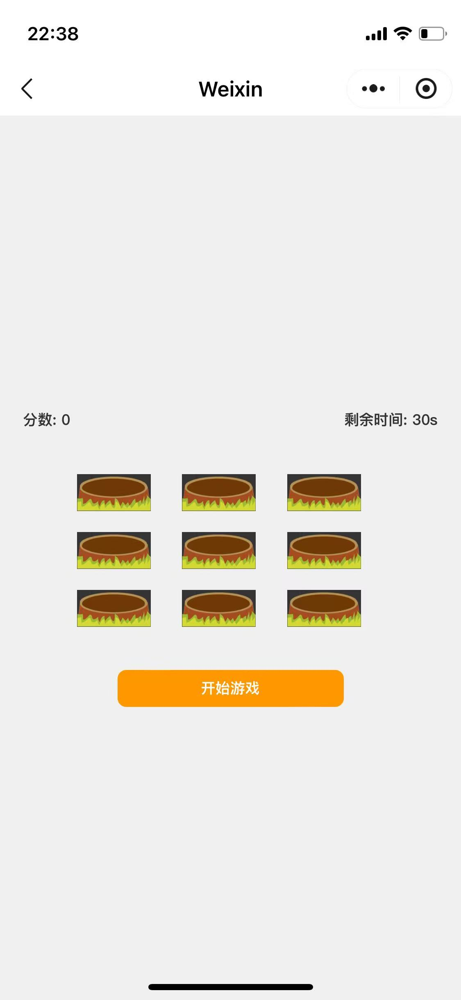

# 打地鼠 WeChat Mini Game

这是一个基于 **WeChat Mini Program** 开发的 **3x3 打地鼠游戏**，玩家点击鼠消于地洞来积分，在指定时间内记得高分。

---



## 游戏特性
- 【3x3布局】 每次随机一个地洞出现鼠
- 【点击选中】 点击鼠积分，点错没有分数
- 【反馈效果】 鼠被打中时改变图片
- 【时间限制】 游戏尽失后显示总分数
- 【添加壁纸】 场景背景图尽量适配游戏

---

---

## 安装和运行
1. **将代码克隆到本地**
```sh
git clone https://github.com/2718564960/whack-a-mole.git
cd whack-a-mole
```

2. **打开 WeChat Developer Tool (微信开发者工具)**
   - 点击 **打开项目**
   - 选择 **whack-a-mole/demo** 目录
   - 将 `project.config.json` 加载

3. **运行小程序**
   - 点击 **编译**
   - 点击 **预览**

---

## 技术栈
- **WeChat Mini Program API** – 微信小程序官方框架
- **JavaScript (ES6+)** – 实现游戏逻辑
- **WXML & WXSS** – 游戏页面和样式

---

## 源码免费进行优化
若你有任何优化或功能提议，欢迎提 PR 或提出 Issue！

---

## 授权
本项目采用 MIT 协议，自由使用和修改。

